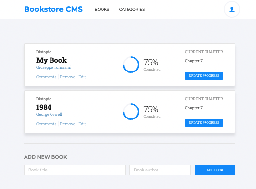

# Bookstore

> The Bookstore is a website that allows you to:

- Display a list of books.
- Add a book.
- Remove a selected book.

## Built With

- Major languages: HTML, SCSS, JS
- Frameworks: React.js
- Technologies used: VSC, Git, GitHub, Gitflow, Chrome.

## Live Demo

[Live Demo Link](https://dev--jade-sprinkles-8acc06.netlify.app/)

## Getting Started

To get a local copy up and running, follow these simple example steps.

### Prerequisites
code editor and browser

### Install
`npm i`

### Usage
use the calculator by clicking on its buttons.

### Run tests
`npm test`

### Deployment
`npm start`

## Authors

👤 **Giuseppe Tomasini**

- GitHub: [@GiuseppeTG](https://github.com/GiuseppeTG)
- Twitter: [@giusetomasini](https://twitter.com/giusetomasini)
- LinkedIn: [Giuseppe Tomasini](https://www.linkedin.com/in/giuseppe-tomasini-67ba101a8/)

## 🤝 Contributing

Contributions, issues, and feature requests are welcome!

Feel free to check the [issues page](../../issues/).

## Show your support

Give a ⭐️ if you like this project!

## 📝 License

This project is [MIT](./MIT.md) licensed.
